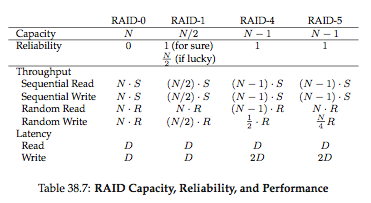

# OSTEP Part1(Virtualization) 笔记

大部分截图来自原书，贴出书的官方主页： 《[Operating Systems: Three Easy Pieces](http://pages.cs.wisc.edu/~remzi/OSTEP/)》
(作者Remzi H. Arpaci-Dusseau and Andrea C. Arpaci-Dusseau)。感谢原作者这么好的书。

## 第一节 进程的抽象

#### 1. 策略和机制

Policy在mechanism（策略和机制）在操作系统中通常是分开设计的。比如如何切换上下文是一个low-level的mechanism，指底层的方法或者协议。当前时刻应该让哪个进程运行更好是一个high-level的policy的问题，指一些“智能”的调度。

#### 2. 虚拟化和OS

OS本身就可以看做是“虚拟机”(virtual machine)。系统通过在可以被接受的合理开销（时间、空间）范围内，将计算机CPU、内存、存储等资源进行虚拟化（抽象），目的是为了用户的方便使用。

**CPU虚拟化** 主要体现在将任务抽象为 **进程(process)** ，将资源按进程隔离，然后多个进程轮转使用计算资源； **内存虚拟化** 主要体现在 **虚拟地址空间(virtual address space 或 adress space)** ；而对于持久化的 **存储** ，OS让文件共享，没有那么多私有隔离，OS假定用户会用文件来共享数据。 (？？？？)

## 第二节 进程API

#### 1. fork和exec

* exec()函数组和fork()的区别是，exec执行以后就再也不会返回

# OSTEP Part3(Persistence) 笔记

大部分截图来自原书，贴出书的官方主页： 《[Operating Systems: Three Easy Pieces](http://pages.cs.wisc.edu/~remzi/OSTEP/)》
(作者Remzi H. Arpaci-Dusseau and Andrea C. Arpaci-Dusseau)。感谢原作者这么好的书。

## 第一节 I/O Device

#### 1. IO 总线

**一般情况下，** IO设备的性能较差(慢)，所以用Peripheral IO Bus，为什么不用像显卡一样用的PCI呢？因为1)越快的总线越短，这样空间不够插；2)越快的总线制作成本越高，如果存储设备照总线的性能差的远，没必要用高性能总线。

这张图为总线的层次结构，memory bus是最快的也是最近的，IO Bus比较远，也是最慢的，中间有用于显卡的PCI等总线。

#### 2. 典型设备的组成部分

一个典型的外围设备如图所示，包括两部分： **接口** 和 **内部结构** 。

**接口：** 类似软件接口的功能，硬件接口是留给OS和设备交互的。
**内部结构：** 比如㓟CPU、MEM等基本组件，还有称为固件(firmware)的软件来实现内部功能。

#### 3. PIO中的两种模式(Polling和Interrupt)

一种典型的协议是 **Polling** (轮询)，步骤有4: 

* 循环等待STATUS寄存器直到设备状态为不busy
* 写数据到DATA寄存器
* 写命令到COMMAND寄存器
* 循环等待STATUS直到设备为不busy

Polling显著的缺点就是太浪费CPU时间，这是因为IO相对于CPU是很慢的，大量的CPU时间被用在了等待上。

**Interrupt** (中断)方法可以解决这个问题，用Interrupt方法进行IO时，当设备完成操作时，会raise一个硬件interrupt。但是这样的话，如果设备很快(不如现在的NVMe SSD设备)，Interrupt由于需要进程上下文的切换、以及中断的控制等原因，会拖慢IO的速度。所以两种方法各有利弊：

|Polling | Interrupt |
|--------|--------|
| 浪费CPU时间 | 节省CPU时间 |
| 更小的I/O延迟 | 进程切换及中断处理导致高延迟 |

在IO请求压力时大时小不好确定的系统中，更好的方案可能是采用hybrid(混合)的 **两段协议** ，先poll一会儿，还没完成的话改用interrupt方式。还有一种方式是 **中断合并** ，当一个请求完成，等一等，说不定又有新的请求完成了，这样就见小了中断数，减小了中断带来的性能损失，但是这样做的缺点也是显而易见的--用延迟代价换来了高吞吐。

#### 4. 设备交互：PIO和MMIO

以上的Interrupt和Polling都属于Programmed I/O(PIO)的方式，这种方式是CPU通过指令和设备进行的交互。

还有一种称为Memory-mapped I/O(MMIO)，这种方法中，设备寄存器被映射到内存地址空间，OS读写这个映射地址，硬件会自动将存取数据路由到设备而不是主存中。

#### 5. PIO中传输任务的卸载(Direct Memory Access, DMA)

若不使用DMA，虽然可以用中断来讲等待设备IO完成的时间用在其他进程上，但是IO请求中还包括CPU从内存到设备以字长为单位一点一点搬运数据（数据传输）的过程，如图：

有了DMA这种专用设备帮CPU搬运，流水线就可以入下图一样：

当DMA完成任务，DMA控制器会raise一个中断，这样OS就知道传输完成了。

#### 6. 设备驱动和I/O栈

I/O栈各层的抽象(如块设备驱动、文件系统等)当然有好处，其把不同的设备封装成统一的结构，但也有坏处。

其实不是从上层应用到底层驱动会出现信息丢失的问题(我曾经调研过上层到下层会有语义鸿沟的问题)，底层的设备由于统一的抽象也会“丧失个性”，比如SCSI支持多种IO错误信息，但是ATA/IDE却不支持，因此Linux设计成上层文件系统只能接到更"EIO"错误(generic IO errer)。

驱动占Linux源码的70%，很多驱动都是“业余”开发的，因此很多系统崩溃也是由于驱动bug造成的。

## 第三节 RAID

书中有个对比表总结的不错：

## 第四节 文件和目录

文件(file)和目录(directory)是OS虚拟化中存储部分的两个重要的抽象概念。

本节主要解释一些基本的文件操作和对应的系统调用。比如：

| 常用操作 | 系统调用 |
|--------|--------|
|  cat命令   | open() / read() / write()  |
| 数据同步  |   fsync()     |
|   mv命令重命名   |   rename()     |
|  ls的-l参数、stat命令    |   stat() / fstat()      |
|    rm命令    |    unlink()    |
|     mkdir命令    |   mkdir()     |
|文件夹操作函数|opendir() / closedir() / readdir()|
|rmdir命令|rmdir()|

这节还讲了硬链接和软连接、创建和挂载文件系统的内容，略了。。

## 第十节 LFS(log-structured filesystem)

What does “level of indirection” mean in David Wheeler's aphorism?
, https://stackoverflow.com/questions/18003544/what-does-level-of-indirection-mean-in-david-wheelers-aphorism
