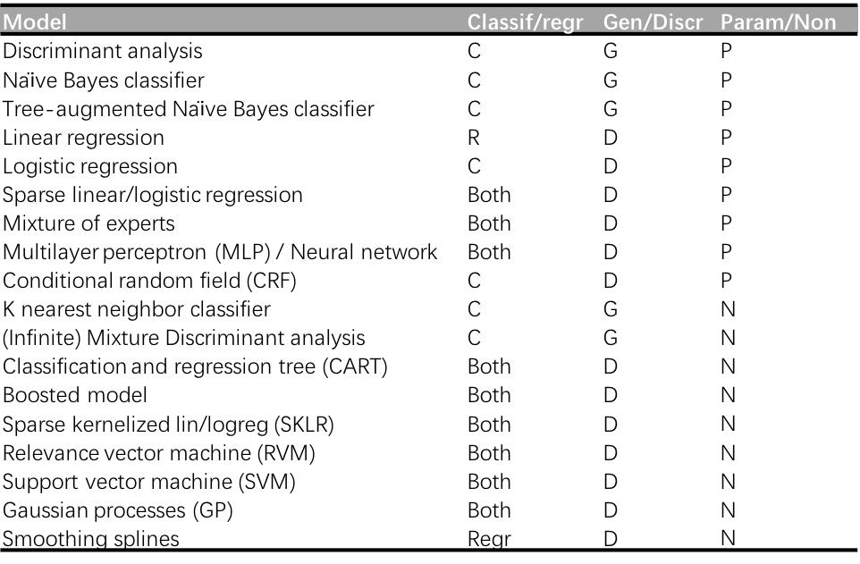

# 机器学习
# 机器学习

## 1. 分类模型和参数估计问题

### 1.1 生成式模型和判别式模型

例如，生成式模型包括最大似然估计（MLE）、朴素贝叶斯（Naive Bayes, NB）、KNN等；而判别式模型包括逻辑回归、BP神经网络、决策树、SVM等。

判别式对 ![f10] 建模，其中 ![f11] 是类别， ![f12] 是样本的特征，这种分类器直接输出样本属于各个类别的概率，若不考虑各个类别的错误分类代价差异，则应该分类为概率最大的那一类。

生成式对 ![f13] 建模，进而可以由贝叶斯公式 ![f14] 得出 ![f15] ，这种分类器会输出当前的特征值 ![f12] 在各个类别的模型的概率值，一般可以分类为 ![f12] 特征下概率最大的类别。

[f10]: http://chart.apis.google.com/chart?cht=tx&chl=P(c_i|\vec{x})
[f11]: http://chart.apis.google.com/chart?cht=tx&chl=c_i
[f12]: http://chart.apis.google.com/chart?cht=tx&chl=\vec{x}
[f13]: http://chart.apis.google.com/chart?cht=tx&chl=P(c_i,\vec{x})
[f14]: http://chart.apis.google.com/chart?cht=tx&chl=P(\vec{x}|c_i)=\frac{P(c_i,\vec{x})}{P(\vec{x})}
[f15]: http://chart.apis.google.com/chart?cht=tx&chl=P(\vec{x}|c_i)

### 1.2 参数估计和非参数估计

举例来说，参数密度估计包括最大似然估计（MLE）等，非参数密度估计包括朴素贝叶斯（Naive Bayes, NB）、K近邻（KNN）、核函数估计（KDE）等。

简单说，参数估计可以假定某类符合某种分布，比如高斯分布由均值μ和方差![f2]两个参数决定。

[f2]: http://chart.apis.google.com/chart?cht=tx&chl=\sum